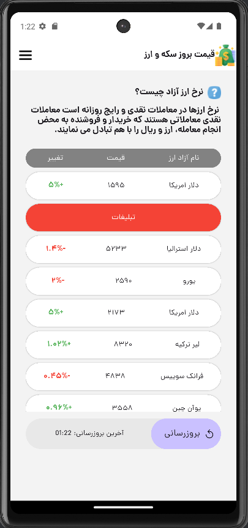
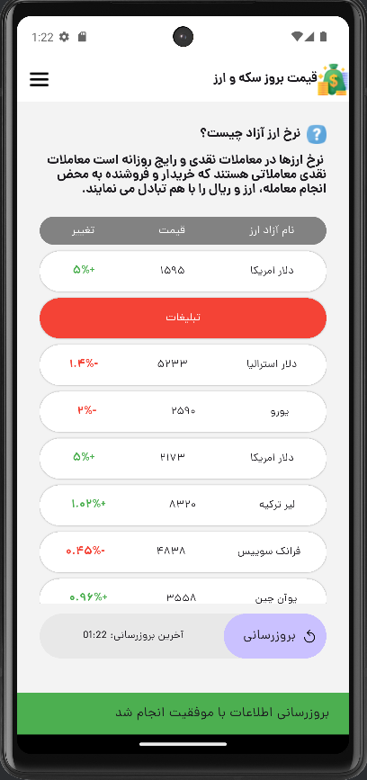

# CurrencyPrices 💱

A Flutter-based mobile application designed to provide real-time currency exchange rates fetched from an API. CurrencyPrices offers a clean and user-friendly interface in Persian (Farsi), helping users stay informed about the latest currency prices and their daily fluctuations.

## Features ✨
- Real-time currency exchange rates display.
- Daily price changes with color-coded indicators (green for positive, red for negative).
- Persian language support with a custom font (Dana).
- Manual refresh option for updating rates.
- Clean UI with integrated advertisements for monetization.

## Screenshots 📸
### Main Screen
  
*The screenshot above displays the main screen of CurrencyPrices, listing various currencies with their prices and daily changes. The interface is in Persian, featuring a refresh button for updating rates and a brief explanation about free market exchange rates.*

### Additional View
  
*This screenshot shows another view of the app, highlighting more currency details or a different section of the interface.*

## How It Works 🛠️
1. CurrencyPrices fetches data from an API (`http://sasansafari.com/flutter/api.php`) to retrieve the latest currency rates.
2. Rates are presented in a scrollable list, with each entry showing the currency name, price, and change percentage.
3. Users can manually refresh the data using the "بروزرسانی" (Update) button at the bottom.
4. A short description about free market exchange rates is included at the top for user education.

## Installation 📦
1. Clone the repository:
   ```bash
   git clone https://github.com/7Na7iD7/CurrencyPrices.git

## Navigate to the project directory:
2: cd CurrencyPrices
   
## Install dependencies:
3: flutter pub get

## Run the app:
4: flutter run